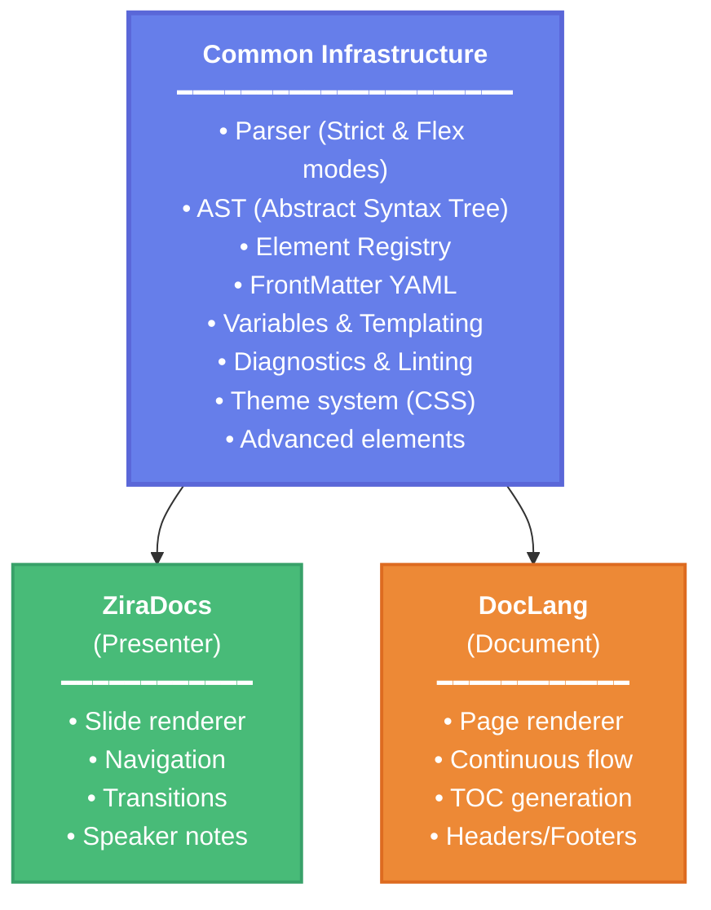

# DocLang - Document Generation DSL

## 🎯 Vision

**DocLang** is a sibling DSL (Domain-Specific Language) to ZiraDocs, designed specifically for generating professional documents (Word-like, PDF, HTML) instead of presentations. DocLang reuses all of ZiraDocs's mature infrastructure (parser, elements, validation, themes) but shifts the output paradigm from "slides" to "continuous document".

## 🏗️ Inherited Architecture

DocLang **does NOT** reinvent the wheel. It leverages 100% of the existing infrastructure:



## 🔑 Key Differences

| Aspect | ZiraDocs | DocLang |
|---------|-----------|---------|
| **Output** | Presentation (discrete slides) | Continuous document (fluid pages) |
| **Structure** | Independent slides | Hierarchical sections and subsections |
| **Navigation** | Slide-to-slide (linear/non-linear) | Continuous scroll + TOC |
| **Layout** | Layouts specialized per slide | Templates per section |
| **Pagination** | Explicit (1 slide = 1 screen) | Automatic (content flows across pages) |
| **Interactivity** | Transitions, presenter mode | Hyperlinks, cross-references, index |
| **Format** | HTML5 presentation, PDF slides | HTML document, PDF document, DOCX |

## 🎨 Syntax Design

DocLang keeps the **same two modes** as ZiraDocs:

### Strict Mode

```doclang
---
mode: strict
title: "Technical Specification Document"
doctype: document
output:
  format: [html, pdf, docx]
  path: "./dist"
---

SECTION 1 "Introduction"
  level: 1
  
  TEXT
    This document describes the technical specifications for the new system.
    
  SUBSECTION "Purpose"
    level: 2
    
    TEXT
      The purpose of this document is to provide comprehensive technical details.
      
SECTION 2 "Architecture"
  level: 1
  
  TEXT
    System architecture overview.
    
  <<mermaid>>
    graph TD
      A[Client] --> B[API Gateway]
      B --> C[Services]
```

### Flex Mode (Extended Markdown)

```doclang
---
mode: flex
title: "Technical Specification Document"
doctype: document
output:
  format: [html, pdf, docx]
---

# 1. Introduction

This document describes the technical specifications for the new system.

## 1.1 Purpose

The purpose of this document is to provide comprehensive technical details.

## 1.2 Scope

The scope includes all system components and their interactions.

---

# 2. Architecture

System architecture overview.

<<mermaid>>
  graph TD
    A[Client] --> B[API Gateway]
    B --> C[Services]

## 2.1 Components

The system consists of the following components:

- **API Gateway**: Entry point for all requests
- **Services**: Business logic layer
- **Database**: Data persistence layer
```

## 🧩 Supported Elements

DocLang inherits **ALL** of ZiraDocs's elements:

### Text Elements
- ✅ Paragraphs (TEXT in strict, plain text in flex)
- ✅ Ordered and unordered lists (POINTS / Markdown lists)
- ✅ Inline formatting (bold, italic, code, links)
- ✅ Quote blocks
- ✅ Special blocks (:::info, :::warning, :::success, :::danger)

### Technical Elements
- ✅ Code blocks with syntax highlighting (CODE / fenced code blocks)
- ✅ Tables (TABLE / Markdown tables)
- ✅ Images with captions (IMAGE / Markdown images)

### Advanced Elements
- ✅ Interactive charts (<<chart: type>>)
- ✅ Mermaid diagrams (<<mermaid>>)
- ✅ Interactive maps (<<map>>)
- ✅ Code groups with tabs

### New Elements Specific to DocLang
- 🆕 Automatic Table of Contents (<<toc>>)
- 🆕 Cross-references (<<ref: section-id>>)
- 🆕 Footnotes (<<footnote: id>>)
- 🆕 Term index (<<index>>)
- 🆕 Bibliography (<<bibliography>>)
- 🆕 Explicit page breaks (<<pagebreak>>)

## 📄 DocLang FrontMatter

```yaml
---
# Parsing mode (required)
mode: flex  # or "strict"

# Document type (required for DocLang)
doctype: document

# Document metadata
title: "Document Title"
subtitle: "Optional Subtitle"
author: "Author Name"
authors:
  - name: "John Doe"
    affiliation: "Company Inc."
  - name: "Jane Smith"
    affiliation: "University X"
date: "2024-10-08"
version: "1.0.0"

# Output configuration
output:
  format: [html, pdf, docx]
  path: "./dist"
  filename: "technical-spec"
  
# Page configuration
page:
  size: "A4"        # A4, Letter, Legal
  orientation: "portrait"  # portrait, landscape
  margins:
    top: "2.5cm"
    bottom: "2.5cm"
    left: "3cm"
    right: "3cm"

# Headers and footers
header:
  enabled: true
  odd_pages: "{{title}}"
  even_pages: "{{section_title}}"
  style: "minimal"
  
footer:
  enabled: true
  page_numbers:
    enabled: true
    format: "Page {{current}} of {{total}}"
    alignment: "center"
  odd_pages: "{{date}}"
  even_pages: "{{author}}"

# Table of contents
toc:
  enabled: true
  depth: 3          # Heading levels to include (1-6)
  title: "Table of Contents"
  page_numbers: true
  
# Section numbering
numbering:
  enabled: true
  style: "hierarchical"  # hierarchical (1.1.1) or sequential (1, 2, 3)
  prefix: ""
  suffix: "."
  
# References and citations
references:
  style: "apa"      # apa, mla, chicago, ieee
  
# Visual theme
theme: "professional"

# Custom variables
variables:
  company: "Acme Corp"
  project: "Phoenix"
  confidentiality: "Internal Use Only"
---
```

## 🔄 Code Reuse

### Parser
```go
// DocLang uses the SAME parser as ZiraDocs
parser := parser.New(logger)

// The parser automatically detects whether it's a document or a presentation
ast, diagnostics := parser.Parse(content, filepath)

// The AST is the same; only the interpretation in the generator changes
```

### Generator
```go
// New generator specific to documents
type DocumentGenerator struct {
    ast      *ast.AST
    config   *config.Config
    renderer *DocumentRenderer
}

// The DocumentRenderer interprets the AST as a document instead of slides
func (g *DocumentGenerator) Generate() ([]byte, error) {
    // 1. Generate TOC if enabled
    if g.config.TOC.Enabled {
        toc := g.generateTOC()
        g.renderer.RenderTOC(toc)
    }
    
    // 2. Render sections in continuous flow
    for _, node := range g.ast.Sections {
        g.renderer.RenderSection(node)
    }
    
    // 3. Generate references and bibliography
    if g.config.References.Enabled {
        refs := g.generateReferences()
        g.renderer.RenderReferences(refs)
    }
    
    return g.renderer.Output()
}
```

## 🎯 Implementation Plan

### Phase 1: Base Infrastructure (COMPLETED)
- ✅ Dual-mode parser (strict/flex)
- ✅ Complete AST
- ✅ Element registry
- ✅ FrontMatter processing
- ✅ Variables & templating
- ✅ Diagnostics system
- ✅ Theme system

### Phase 2: DocLang Core (NEW)
- 🆕 Extend FrontMatter with document-specific fields
- 🆕 Create DocumentGenerator
- 🆕 Implement DocumentRenderer (HTML)
- 🆕 Implement TOC generator
- 🆕 Implement page layout system
- 🆕 Implement header/footer system

### Phase 3: Advanced Document Elements (NEW)
- 🆕 Cross-references (<<ref>>)
- 🆕 Footnotes (<<footnote>>)
- 🆕 Bibliography (<<bibliography>>)
- 🆕 Term index (<<index>>)
- 🆕 Page breaks (<<pagebreak>>)

### Phase 4: Export (NEW)
- 🆕 HTML document export
- 🆕 PDF document export (using wkhtmltopdf or similar)
- 🆕 DOCX export (using pandoc or a Go library)

### Phase 5: Themes and Styles (ADAPTATION)
- 🆕 Adapt the theme system for documents
- 🆕 Create document-specific themes
- 🆕 Styles for print vs. screen

## 🚀 CLI Commands

```bash
# Generate HTML document
doclang build spec.doclang --format html --output ./dist

# Generate PDF document
doclang build spec.doclang --format pdf --output ./dist

# Generate DOCX document
doclang build spec.doclang --format docx --output ./dist

# Generate all formats
doclang build spec.doclang --format html,pdf,docx --output ./dist

# Preview in browser
doclang preview spec.doclang

# Linting
doclang lint spec.doclang --strict

# Watch mode for development
doclang watch spec.doclang --format html
```

## 🎨 Document Themes

DocLang will have themes specific to documents:

- `professional` - Formal corporate style
- `academic` - Academic/scientific style
- `technical` - Technical documentation
- `minimal` - Minimalist and clean
- `modern` - Modern design
- `legal` - Legal/contractual format
- `report` - Business reports

## 📊 Output Comparison

### ZiraDocs Output (Presentation)
```html
<!DOCTYPE html>
<html>
<head>
  <title>Presentation</title>
  <link rel="stylesheet" href="presentation.css">
</head>
<body class="sl-presentation">
  <div class="sl-slide sl-slide--title">
    <h1>Welcome</h1>
  </div>
  <div class="sl-slide sl-slide--content">
    <h2>Content</h2>
    <p>Information</p>
  </div>
  <nav class="sl-navigation">...</nav>
</body>
</html>
```

### DocLang Output (Document)
```html
<!DOCTYPE html>
<html>
<head>
  <title>Document</title>
  <link rel="stylesheet" href="document.css">
</head>
<body class="dl-document">
  <header class="dl-header">
    <div class="dl-logo">...</div>
    <div class="dl-title">Document Title</div>
  </header>
  
  <nav class="dl-toc">
    <h2>Table of Contents</h2>
    <ul>
      <li><a href="#section-1">1. Introduction</a></li>
      <li><a href="#section-2">2. Architecture</a></li>
    </ul>
  </nav>
  
  <main class="dl-content">
    <section id="section-1" class="dl-section dl-section--level-1">
      <h1>1. Introduction</h1>
      <p>Content flows continuously...</p>
      
      <section id="section-1-1" class="dl-section dl-section--level-2">
        <h2>1.1 Purpose</h2>
        <p>More content...</p>
      </section>
    </section>
    
    <section id="section-2" class="dl-section dl-section--level-1">
      <h1>2. Architecture</h1>
      <p>Architecture content...</p>
    </section>
  </main>
  
  <footer class="dl-footer">
    <div class="dl-page-number">Page 1 of 10</div>
  </footer>
</body>
</html>
```

## ✨ Benefits

1. **Reuse**: 90% of ZiraDocs's code is reused
2. **Consistency**: Same syntax, same parser, same elements
3. **Maturity**: Inherits all of ZiraDocs's robustness
4. **Flexibility**: Two modes (strict/flex) for different needs
5. **Power**: All advanced elements (charts, mermaid, maps)
6. **Professionalism**: Professional-quality output
7. **Maintainability**: A single codebase for two DSLs

## 🎓 Use Cases

### Technical Documentation
```doclang
---
mode: flex
doctype: document
title: "API Documentation"
theme: technical
---

# API Reference

## Authentication

All API requests require authentication...

<<code: javascript>>
const token = await getAuthToken();
fetch('https://api.example.com/data', {
  headers: { 'Authorization': `Bearer ${token}` }
});
<<>>
```

### Business Reports
```doclang
---
mode: flex
doctype: document
title: "Q3 2024 Performance Report"
theme: professional
---

# Executive Summary

This report presents the Q3 2024 performance metrics...

<<chart: bar>>
  data: [["Q1", 125], ["Q2", 145], ["Q3", 189]]
  series: ["Revenue (K)"]
<<>>
```

### Technical Specifications
```doclang
---
mode: strict
doctype: document
title: "System Architecture Specification"
theme: technical
---

SECTION "System Overview"
  level: 1
  
  TEXT
    The system architecture follows microservices patterns...
    
  <<mermaid>>
    graph TB
      A[Client] --> B[Gateway]
      B --> C[Service 1]
      B --> D[Service 2]
  <<>>
```

## 🔮 Roadmap

### ✅ v1.0 - Core Features (COMPLETED)
- [x] Parser infrastructure (inherited)
- [x] Basic DocumentGenerator
- [x] HTML output
- [x] TOC generation
- [x] Basic themes (3-4)
- [x] **DOCX export** 🎉

**DOCX Export Status:** functional, with known caveats (no clickable hyperlinks/bookmarks/shading
yet) — see the [issue tracker](https://github.com/ziradocs/toolchain/issues) for current gaps.

### v1.1 - Advanced Features (IN PROGRESS)
- [x] PDF export (via Chromium — see the root README's output-formats table)
- [ ] Cross-references
- [ ] Footnotes
- [ ] Term index

### v1.2 - Professional Features
- [ ] Advanced bibliography
- [ ] Citation styles
- [ ] Customizable templates

### v2.0 - Enterprise Features
- [ ] Document versioning
- [ ] Multi-author collaboration
- [ ] Review and comments
- [ ] Integration with document management systems

## 📚 Resources

- [ZiraDocs Documentation](../user/README.md)
- [Parser Architecture](../developer/architecture/parser.md)
- [Theme System](../developer/systems/themes.md)
- [Element Registry](../developer/architecture/elements.md)
